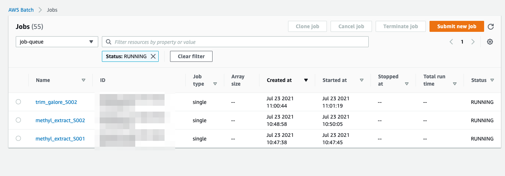

# Prerequisite

1. Java 
2. Nextflow
3. Go

## Nextflow installation

```
> cd ~
> curl -s https://get.nextflow.io | bash
> export PATH=$PATH:~
```

## Goodls installation

```
> cd ~
> go get -u github.com/tanaikech/goodls
> export PATH=$PATH:~/go/bin/
```

## AWS resources
### Create compute environment
1. Open https://ap-southeast-1.console.aws.amazon.com/batch/home?region=ap-southeast-1#compute-environments
2. Click `create` 
3. Fill in as follow:
    1. Compute environment name: ec2-spot-compute-environment
    2. Provisioning model: spot
    3. Leave the rest as default
4. Click `create compute environment`

### Create job queues
1. Open https://ap-southeast-1.console.aws.amazon.com/batch/home?region=ap-southeast-1#queues/new
2. Fill in as follow:
    1. Job queue name: my-job-queue
    2. Select a compute environment: ec2-spot-compute-environment
3. Click `Create`

### Create temp bucket

1. Open https://s3.console.aws.amazon.com/s3/bucket/create?region=ap-southeast-1
2. Fill in as follow:
    1. Bucket name: `nextflow-temp-<timestamp>`
3. Click `Create bucket`

### Create output bucket

1. Open https://s3.console.aws.amazon.com/s3/bucket/create?region=ap-southeast-1
2. Fill in as follow:
    1. Bucket name: `nextflow-ouput-<timestamp>`
3. Click `Create bucket`

# Usage
## Clone repo
```
> git clone https://github.com/sebastianlzy/nextflow-demo
> cd nextflow-demo
```

## Download data
```
> pwd
<path>/nextflow-demo
> goodls -u https://drive.google.com/file/d/1K8oPgVFJZwB_T2nJPc-TmvMGYg7oyU-e/view?usp=sharing
Downloading (bytes)... 5848241
{"Filename": "data.zip", "Type": "file", "MimeType": "application/zip", "FileSize": 5848241}
> unzip data.zip
```

### Copy wgbs data to output bucket
```
> goodls -u https://drive.google.com/file/d/12lVQdYW3rH78P-twMHL1mIZ6bzM1aj96/view?usp=sharing
> unzip wgbs.zip
> aws s3 cp ./wgbs_genome s3://nextflow-output-<timestamp>/wgbs_genome --recursive
```

## Run

```
# Edit bucket url
> vim ./run.sh
export S3_OUPUT_BUCKET=s3://nextflow-ouput-<timestamp>
export S3_TEMP_BUCKET=s3://nextflow-temp-<timestamp>
...
```

```
# Run script
> . ./run.sh
```

# References

## AWS batch jobs


# Calculate ec2 pricing
