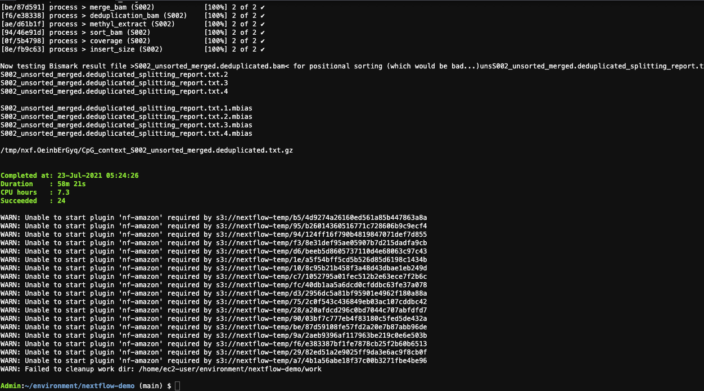

# Prerequisite

1. Java 
2. Nextflow
3. Go
4. AWS configuration and credential setup - https://docs.aws.amazon.com/cli/latest/userguide/cli-configure-files.html
5. AWS CDK
6. jq


## Nextflow installation

```
> cd ~
> curl -s https://get.nextflow.io | bash
> export PATH=$PATH:~
```

## Goodls installation

```
> cd ~
> go get -u github.com/tanaikech/goodls
> export PATH=$PATH:~/go/bin/
```

## CDK installation

```
> npm install -g aws-cdk
> cdk --version
```

## jq installation

```
sudo yum install jq
```

# Usage
## 1. Clone repo
```
> cd ~
> git clone https://github.com/sebastianlzy/nextflow-demo
```

## 2. Create AWS resources

Option 1: CDK (preferred)

```
> cd ~/nextflow-demo/aws-resources-cdk
> npm install
> npm run cdk:deploy
```

<details>
<summary>Option 2: Manual</summary>

#### Create compute environment
1. Open https://ap-southeast-1.console.aws.amazon.com/batch/home?region=ap-southeast-1#compute-environments
2. Click `create`
3. Fill in as follow:
   1. Compute environment name: `ec2-spot-compute-environment`
   2. Provisioning model: `spot`
   3. Leave the rest as default
4. Click `Create compute environment`

#### Create job queues
1. Open https://ap-southeast-1.console.aws.amazon.com/batch/home?region=ap-southeast-1#queues/new
2. Fill in as follow:
   1. Job queue name: `job-queue`
   2. Select a compute environment: `ec2-spot-compute-environment`
3. Click `Create`

#### Create temp bucket

1. Open https://s3.console.aws.amazon.com/s3/bucket/create?region=ap-southeast-1
2. Fill in as follow:
   1. Bucket name: `nextflow-temp-<timestamp>`
3. Click `Create bucket`

### Create output bucket

1. Open https://s3.console.aws.amazon.com/s3/bucket/create?region=ap-southeast-1
2. Fill in as follow:
   1. Bucket name: `nextflow-ouput-<timestamp>`
3. Click `Create bucket`

### Update aws resource

1. `vim aws-output.json`
2. Fill in all the necessary information in the json

```
{
  "NextflowDemoCdkStack": {
    "tempBucketName": "nextflowdemocdkstack-nextflowtemp498b6c2a-c1siyr411tge",
    "iamBatchRoleName": "aws-batch-nextflow-demo-role",
    "outputBucketName": "nextflowdemocdkstack-nextflowoutput8388dea5-1b8tc4n2wo6tn",
    "jobQueueName": "arn:aws:batch:ap-southeast-1:134800022762:job-queue/nextflow-job-queue-demo"
  }
}

```

</details>

## 3. Download data
```
> cd ~/nextflow-demo
> goodls -u https://drive.google.com/file/d/1K8oPgVFJZwB_T2nJPc-TmvMGYg7oyU-e/view?usp=sharing
Downloading (bytes)... 5848241
{"Filename": "data.zip", "Type": "file", "MimeType": "application/zip", "FileSize": 5848241}
> unzip data.zip
```

### 4. Copy wgbs data to output bucket
```
> cd ~/nextflow-demo
> goodls -u https://drive.google.com/file/d/12lVQdYW3rH78P-twMHL1mIZ6bzM1aj96/view?usp=sharing
> unzip wgbs_genomes.zip
> aws s3 cp ./wgbs_genomes s3://$(cat aws-outputs.json | jq -r '.NextflowDemoCdkStack.outputBucketName')/wgbs_genomes --recursive
```

## 5. Run pipeline

```
# Run script
> cd ~/nextflow-demo
> . ./run.sh
```

# References

## Steps to configure on cloud9
1. Setup dependencies, `. ./helper/setup-dependencies-in-cloud9.sh`
2. Create AWS resources in step (2)
3. In Cloud9, Open Preferences > AWS Settings
   1. Turn off `AWS managed temporary credentials`
2. Open https://ap-southeast-1.console.aws.amazon.com/ec2/v2/home?region=ap-southeast-1#Instances:instanceState=running
3. Select Cloud9 instance
   1. Actions > Security > Modify IAM role
   2. NextflowDemoCDKStack-awsec2nextflowdemoinstanceprofileid-<HashId>


## AWS batch jobs


## Output in terminal
